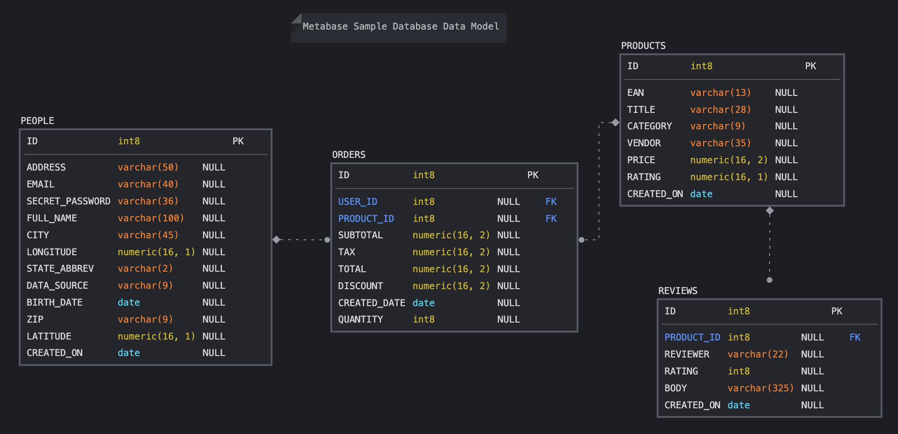

<div id="top"></div>
<!--
*** Thanks for checking out this README file.
*** If you have a suggestion, please fork the repo and create a pull request
*** or open an issue with the tag "enhancement".
*** Don't forget to give the project a star!
*** Thank you!
-->

<div align="center">
<h3 align="center">Metabase Sample Database</h3>
  <p align="center">
    H2 Sample Database's data ready to be imported to your PostgreSQL or MySQL database
    <br />
    <a href="https://github.com/sergiosouzalima/metabase-sample-database">
    <strong>Explore the docs »</strong></a>
    <br />
    <br />
    <a href="https://github.com/sergiosouzalima/metabase-sample-database/issues">Report Bug</a>
    ·
    <a href="https://github.com/sergiosouzalima/metabase-sample-database/issues">Request Feature</a>
  </p>
</div>

<!-- TABLE OF CONTENTS -->
<details>
  <summary>Table of Contents</summary>
  <ol>
    <li>
      <a href="#about-the-project">About the Project</a>
      <ul>
        <li><a href="#how-it-works">How it works</a></li>
        <li><a href="#database-diagram">Database Entity-Relationship Diagram</a></li>
        <li><a href="#built-with">Built with</a></li>
      </ul>
    </li>
    <li>
      <a href="#getting-started">Getting Started</a>
      <ul>
        <li><a href="#prerequisites">Prerequisites</a></li>
        <li><a href="#installation">Installation</a></li>
      </ul>
    </li>
    <li><a href="#usage">Usage</a></li>
    <li><a href="#contributing">Contributing</a></li>
    <li><a href="#license">License</a></li>
    <li><a href="#contact">Contact</a></li>
    <li><a href="#acknowledgments">Acknowledgments</a></li>
  </ol>
</details>

<!-- ABOUT THE PROJECT -->

<div id="about-the-project"></div>


## About the Project

* The <a href="https://www.metabase.com/glossary/sample_database" target="_blank">Sample Database</a> is a small <a href="https://www.h2database.com/html/main.html" target="_blank">H2 database</a> that ships with <a href="https://www.metabase.com" target="_blank">Metabase</a>, a Business Inteligence (BI) and analytics tool.

* You can find in this repository, The Sample Database's data exported in script files. They are insert commands script files, compatible with <a href="https://www.postgresql.org" target="_blank">PostgreSQL</a> and <a href="https://www.mysql.com" target="_blank">MySQL</a>.

* I hope this repository helps you to have a simple dataset for your <a href="https://www.metabase.com" target="_blank">Metabase</a> project or any other BI tool.

<div id="how-it-works"></div>

### How it Works

* If you are connected to a <a href="https://www.postgresql.org" target="_blank">PostgreSQL</a> or <a href="https://www.mysql.com" target="_blank">MySQL</a> instance, you can simply run the scripts from this repo, and you'll have a fully-populated database.

- Basic steps:
  - Connect to a <a href="https://www.postgresql.org" target="_blank">PostgreSQL</a> or <a href="https://www.mysql.com" target="_blank">MySQL</a> database.
    - You'll need creation database, creation table & insert rows privileges.
  - Create a database for this project if you want. This is not mandatory.
  - In your database, run the scripts as follows. The order of execution is important:
1. <a href="https://github.com/sergiosouzalima/metabase-sample-database/blob/master/metabase_sample_db_creation_script.sql">metabase_sample_db_creation_script.sql</a>
2. <a href="https://github.com/sergiosouzalima/metabase-sample-database/blob/master/people_insert_script.sql">people_insert_script.sql</a>
3. <a href="https://github.com/sergiosouzalima/metabase-sample-database/blob/master/products_insert_script.sql">products_insert_script.sql</a>
4. <a href="https://github.com/sergiosouzalima/metabase-sample-database/blob/master/reviews_insert_script.sql">reviews_insert_script.sql</a>
5. <a href="https://github.com/sergiosouzalima/metabase-sample-database/blob/master/orders_insert_script.sql">orders_insert_script.sql</a>

<div id="database-diagram"></div>

### Metabase Sample Database Entity-Relationship Diagram



* Diagram made with <a href="https://sqldbm.com">SqlDBM</a> **awesome** data modeling tool.

<div id="built-with"></div>

### Built with

* With <a href="https://hop.apache.org" target="_blank">Apache HOP version 1.2.0</a> I could export all the existent data from H2 database.
* <a href="https://dbeaver.io" target="_blank">DBeaver</a> was useful to generate insert script files.

<p align="right">(<a href="#top">back to top</a>)</p>


<!-- GETTING STARTED -->
## Getting Started

<div id="prerequisites"></div>

### Prerequisites

1. <a href="https://git-scm.com" target="_blank">Git</a>, the distributed version control system.
2. An up and running instance of a <a href="https://www.postgresql.org" target="_blank">PostgreSQL</a> or <a href="https://www.mysql.com" target="_blank">MySQL</a> database.

<div id="installation"></div>

### Installation

1. See the <a href="#usage">Usage</a> section.

<p align="right">(<a href="#top">back to top</a>)</p>

<!-- USAGE EXAMPLES -->

<div id="usage"></div>

## Usage.

1. Clone the repo
   ```sh
   git clone git@github.com:sergiosouzalima/metabase-sample-database.git
   ```
2. Change directory to `metabase-sample-database`
   ```sh
   cd metabase-sample-database
   ```
3. You'll see the scripts that you need to create and load data to your Sample Database.

4. In your database, run the scripts in directory to `metabase-sample-database` as follows. The order of execution is important:
1. <a href="https://github.com/sergiosouzalima/metabase-sample-database/blob/master/metabase_sample_db_creation_script.sql">metabase_sample_db_creation_script.sql</a>
2. <a href="https://github.com/sergiosouzalima/metabase-sample-database/blob/master/people_insert_script.sql">people_insert_script.sql</a>
3. <a href="https://github.com/sergiosouzalima/metabase-sample-database/blob/master/products_insert_script.sql">products_insert_script.sql</a>
4. <a href="https://github.com/sergiosouzalima/metabase-sample-database/blob/master/reviews_insert_script.sql">reviews_insert_script.sql</a>
5. <a href="https://github.com/sergiosouzalima/metabase-sample-database/blob/master/orders_insert_script.sql">orders_insert_script.sql</a>


<p align="right">(<a href="#top">back to top</a>)</p>

<!-- CONTRIBUTING -->

<div id="contributing"></div>

## Contributing

Contributions are what make the open source community such an amazing place to learn, inspire, and create.

Any contributions you make are **greatly appreciated**.

If you have a suggestion that would make this better, please fork the repo and create a pull request.

You can also simply open an <a href="https://github.com/sergiosouzalima/metabase-sample-database/issues">issue</a> with the tag "enhancement".

Don't forget to give the project a star! Thanks again!

1. Fork the Project
2. Create your Feature Branch (git checkout -b feature/AmazingFeature)
3. Commit your Changes (git commit -m 'Add some AmazingFeature')
4. Push to the Branch (git push origin feature/AmazingFeature)
5. Open a Pull Request

<p align="right">(<a href="#top">back to top</a>)</p>

<!-- LICENSE -->

<div id="license"></div>

## License

Distributed under the MIT License <a href="https://www.google.com/search?q=MIT+license&sxsrf=ALiCzsau_v3Gey9rKHFZXjAtM7pfNTQgzg%3A1657904235316&ei=a5zRYvH-EtSf5OUPkv2byA0&ved=0ahUKEwix4JHIrvv4AhXUD7kGHZL-BtkQ4dUDCA0&uact=5&oq=MIT+license&gs_lcp=Cgdnd3Mtd2l6EAMyBAgAEEMyBQgAEMsBMgUIABDLATIICAAQyQMQywEyBQgAEMsBMgUIABDLATIFCAAQywEyBQgAEIAEMgUIABCABDIFCAAQgAQ6BwgAEEcQsAM6CggAEOQCELADGAE6DAguEMgDELADEEMYAjoPCC4Q1AIQyAMQsAMQQxgCOgQILhBDOgoILhDHARDRAxBDOgoILhDHARCvARBDOgsILhCABBDHARDRAzoLCC4QgAQQxwEQrwE6DQguEMcBENEDEAoQywFKBAhBGABKBAhGGAFQ2AZYrBZgsCZoAXABeACAAYYCiAGuCZIBBTAuNy4xmAEAoAEByAEPwAEB2gEGCAEQARgJ2gEGCAIQARgI&sclient=gws-wiz">MIT</a>.

<p align="right">(<a href="#top">back to top</a>)</p>

<!-- CONTACT -->

<div id="contact"></div>

## Contact

Sergio Lima - [@sergiosouzalima](https://twitter.com/sergiosouzalima) - sergiosouzalima@gmail.com

This project on Github: [https://github.com/sergiosouzalima/metabase-sample-database](https://github.com/sergiosouzalima/metabase-sample-database)

<p align="right">(<a href="#top">back to top</a>)</p>

<!-- ACKNOWLEDGMENTS -->

<div id="acknowledgments"></div>

## Acknowledgments

* [Metabase Brasil on Telegram](https://t.me/metabasebrasil)
* [Apache Hop Brasil on Telegram](https://t.me/apachehop)
* [This README template by Othneil Drew](https://github.com/othneildrew/Best-README-Template)

<p align="right">(<a href="#top">back to top</a>)</p>
